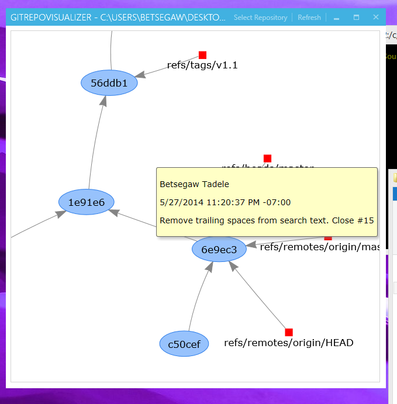

gitrepovisualizer
=================

Simple, beautiful and slow git Visualization

Hovering over the commits will show you details

You can zoom in and zoom out and move the various commits to try and untangle them.

###Issues
Since I am using a web browser control and using visjs in the background, it ends up being really slow loading very large commit histories. The real issue is that the back end should be some c# library but I find them not attractive at all. And for the most part it works and the only penalty is in the initial creation of the graph but the browsing of the graph is actually pretty quick.

###Components used
libgit2sharp

mahapps

visjs
